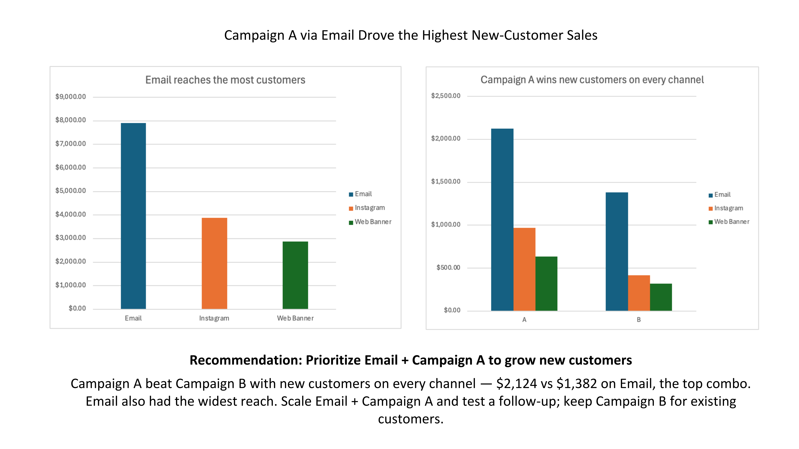

# BCG – Data for Decision Makers Job Simulation (Forage)

**Author:** Fariba Kazi · **Tools:** Excel

Completed BCG's "Introduction to Data for Decision Makers" virtual job simulation on
Forage, acting as a data analyst advising a retail client (NewCo) on a multi-channel
marketing campaign. The campaign tested two message styles (Campaign A – informal vs.
Campaign B – salesy) across three channels (Email, Instagram, Web Banner). The client's
core question: **which campaign + channel combo should they double down on to grow
new-customer sales?**

---

## Task 1 — Campaign Performance Analysis
Explored the raw interaction data and built a pivot table (Campaign × Channel × Sales)
with a slicer to isolate **new customers**.

**Key finding — the insight hinges on segmentation:**
- **Overall**, Campaign B won on total revenue ($8,790 vs $5,870).
- **But for new customers, it flips:** Campaign A outperformed B on every channel, led
  by **Email + Campaign A ($2,124)** vs Email + Campaign B ($1,382).
- Email was the widest-reach channel overall ($7,909 in total sales).

## Task 2 — Communicating Findings
Built two pivot charts in Excel and assembled a client-ready recommendation slide,
plus a short summary email.

**Recommendation:** Prioritize **Email + Campaign A** to grow new-customer sales —
scale that combination and test a follow-up message, while keeping Campaign B to drive
existing-customer revenue.

---

## Files
- `Campaign_Data_Week1.xlsx` — analysis workbook (pivot tables, new-customer slicer, charts)
- `BCG_Task2_Recommendation_Slide.pptx` — client recommendation slide (Task 2 deliverable)
- `recommendation-email.pdf` — short client-ready summary email

> Note: the underlying campaign data is provided by Forage and is not redistributed here.

## Skills
Data analysis · Customer segmentation · Pivot tables · Data visualisation ·
Slide storytelling · Stakeholder communication
